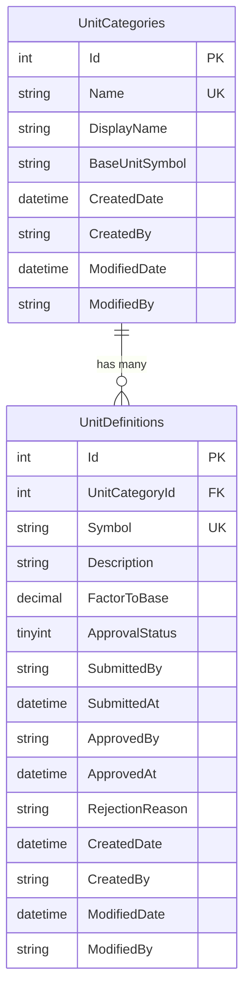
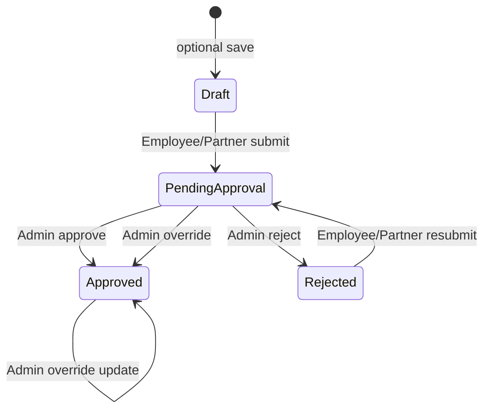

# Unit master data — database schema definition (PROPOSED)

| Field | Value |
|-------|--------|
| **Status** | **PROPOSED — awaiting approval** |
| **Scope** | `ConverterDbContext` / `Data/UnitsMaster/catalog.db` (local) and future **Azure SQL** (or other managed DB) via connection string only |
| **Approach** | EF Core Code First, versioned **migrations** applied to an **existing** database (no `EnsureCreated` on API startup) |
| **Replaces** | Denormalized `UnitDefinitions.Category` enum column (current MVP) |

## Design references (no standalone “database design” skill)

There is no project-specific database-design skill in Cursor. This spec follows:

| Source | How it is used |
|--------|----------------|
| **3NF normalization** | Category attributes live in `UnitCategories`; units reference category by FK, not duplicated category name per row |
| [`csharp-design-quality`](https://github.com/dotnet/skills) / spec-first delivery | Define and approve schema before EF/code changes |
| [dotnet/skills — `dotnet-data`](https://github.com/dotnet/skills/tree/main/plugins/dotnet-data) | EF Core mappings, indexes aligned to queries, review generated migrations |
| [`docs/DATABASE-SCHEMA.md`](../DATABASE-SCHEMA.md) | Auth service pattern (PK, FK, unique, indexes) as the bar for consistency |
| [`docs/ASPIRE-DEV-GUIDE.md`](../ASPIRE-DEV-GUIDE.md) | Local DB created via `setup-local.ps1` / `DbSetup` before apps run |

**Domain note:** `UnitCategory` remains a **domain enum** in `UnitConverter.UnitsDefinitions.Contracts` for conversion rules and API wire names. The database stores categories as **rows** with **stable integer IDs** matching enum values (`1`, `2`, `3`) so APIs and domain logic stay unchanged while persistence is normalized.

---

## Goals

1. **Normalize** categories into `UnitCategories` with PK `Id`.
2. **`UnitDefinitions.UnitCategoryId`** FK → `UnitCategories.Id` (required).
3. **Constraints and indexes** on every column used in WHERE/JOIN and for business uniqueness.
4. **Azure-ready:** same model and migrations against SQLite locally and SQL Server (or PostgreSQL) in cloud; only connection string changes.
5. **EF migrations** are the single source of schema truth; deploy pipeline runs `dotnet ef database update` (or `DbSetup --migrate-only`) against the target database before or during rollout.

---

## Entity-relationship (logical)



---

## Audit columns (`CreatedDate`, `CreatedBy`, `ModifiedDate`, `ModifiedBy`)

Both tables include **who** and **when** for create and last change.

| Column | Set when | Updated when |
|--------|----------|--------------|
| **`CreatedDate`** | Row inserted | **Never** after insert |
| **`CreatedBy`** | Row inserted | **Never** after insert |
| **`ModifiedDate`** | Row inserted | **Every** update |
| **`ModifiedBy`** | Row inserted | **Every** update |

| Rule | Detail |
|------|--------|
| Date type | `datetime2(6)` (SQL Server) / `TEXT` ISO-8601 UTC (SQLite) |
| User type | `nvarchar(254)` — JWT **email** (or `sub` if email unavailable) |
| Cross-DB FK | **No** FK to Auth `Users` (units DB may be separate Azure SQL) |
| Seed / system | `CreatedBy` / `ModifiedBy` = `'system-seed'` for migration seed rows |
| EF Core | Set in repository or `SaveChanges` interceptor; `Created*` properties not modified after insert |

**Distinct from approval columns on `UnitDefinitions`:** `SubmittedBy` / `ApprovedBy` track the approval workflow only. `CreatedBy` / `ModifiedBy` track any insert or update (including admin override of `Description` or `FactorToBase`).

Optional later: `IX_UnitDefinitions_ModifiedDate` if admin UI sorts by last updated.

---

## Table: `UnitCategories`

Lookup / reference data for measurement kinds. Rows are **seeded** and extended only via admin or migration (not created per unit).

| Column | Type (SQL Server) | SQLite | Null | Default | Notes |
|--------|-------------------|--------|------|---------|--------|
| `Id` | `int` | `INTEGER` | NO | — | **PK**, not identity; matches `UnitCategory` enum values |
| `Name` | `nvarchar(32)` | `TEXT` | NO | — | Stable wire key: `length`, `temperature`, `weight` (lowercase) |
| `DisplayName` | `nvarchar(64)` | `TEXT` | NO | — | UI label, e.g. `Length` |
| `BaseUnitSymbol` | `nvarchar(32)` | `TEXT` | NO | — | Canonical base unit symbol for category (`m`, `kg`, `c`) |
| `CreatedDate` | `datetime2(6)` | `TEXT` | NO | UTC now | Row created; immutable |
| `CreatedBy` | `nvarchar(254)` | `TEXT` | NO | `'system-seed'` | Who created (email or system) |
| `ModifiedDate` | `datetime2(6)` | `TEXT` | NO | UTC now | Last update |
| `ModifiedBy` | `nvarchar(254)` | `TEXT` | NO | `'system-seed'` | Who last changed |

### Keys and constraints

| Type | Definition | Name |
|------|------------|------|
| **Primary key** | `Id` | `PK_UnitCategories` |
| **Unique** | `Name` | `IX_UnitCategories_Name_Unique` |

### Indexes (filter columns)

| Index | Columns | Supports |
|-------|---------|----------|
| `IX_UnitCategories_Name_Unique` | `Name` UNIQUE | Resolve category from API query/route wire name |

### Seed data (required)

| Id | Name | DisplayName | BaseUnitSymbol | Maps to `UnitCategory` |
|----|------|-------------|----------------|------------------------|
| 1 | `length` | Length | `m` | `Length = 1` |
| 2 | `temperature` | Temperature | `c` | `Temperature = 2` |
| 3 | `weight` | Weight | `kg` | `Weight = 3` |

`Id` values are **fixed** so existing API clients using enum `category: 0|1|2` in JSON (if any) must be verified separately; domain enum already uses `1, 2, 3`.

---

## Table: `UnitDefinitions`

One row per measurable unit within a category.

### Core fields (symbol & description)

| Column | Type (SQL Server) | SQLite | Null | Default | Notes |
|--------|-------------------|--------|------|---------|--------|
| `Symbol` | `nvarchar(32)` | `TEXT` | NO | — | Short code used in conversion API (`m`, `km`). Stored **lowercase**; immutable after create (same as today). |
| `Description` | `nvarchar(512)` | `TEXT` | NO | — | Human-readable text shown in catalog/admin UI (replaces current `DisplayName`). Example: `Meter`, `Kilometer`. |

**Naming alignment**

| Concept | DB column | API / contract (today) | After implementation |
|---------|-----------|------------------------|----------------------|
| Unit symbol | `Symbol` | `Symbol` | unchanged |
| Unit description | `Description` | `DisplayName` | rename contract to `Description` (or map both during transition) |

### Technical & category fields

| Column | Type (SQL Server) | SQLite | Null | Default | Notes |
|--------|-------------------|--------|------|---------|--------|
| `Id` | `int` | `INTEGER` | NO | identity | **PK** |
| `UnitCategoryId` | `int` | `INTEGER` | NO | — | **FK** → `UnitCategories.Id` |
| `FactorToBase` | `decimal(18,9)` | `TEXT` | NO | — | Linear factor to category base; temperature rows may store `1` (engine uses affine rules) |

### Keys and constraints

| Type | Definition | Name |
|------|------------|------|
| **Primary key** | `Id` | `PK_UnitDefinitions` |
| **Foreign key** | `UnitCategoryId` → `UnitCategories.Id` | `FK_UnitDefinitions_UnitCategories_UnitCategoryId` |
| **Delete rule** | `RESTRICT` on category delete if units exist | Prevents orphaning / accidental category removal |
| **Unique** | (`UnitCategoryId`, `Symbol`) | `IX_UnitDefinitions_UnitCategoryId_Symbol_Unique` |
| **Check** | `FactorToBase > 0` | `CK_UnitDefinitions_FactorToBase_Positive` |
| **Check** | `ApprovalStatus` in (0..3) | `CK_UnitDefinitions_ApprovalStatus` |

### Admin approval fields

Supports **Employee / Partner submit → Admin approve** before units appear in the **public** catalog and conversion lookups.

| Column | Type (SQL Server) | SQLite | Null | Default | Notes |
|--------|-------------------|--------|------|---------|--------|
| `ApprovalStatus` | `tinyint` | `INTEGER` | NO | `2` (Approved) for seed | See enum below |
| `SubmittedBy` | `nvarchar(254)` | `TEXT` | YES | — | JWT `email` or `sub` from Auth (no cross-DB FK to `auth.db`) |
| `SubmittedAt` | `datetime2(6)` | `TEXT` | YES | — | When moved to Pending |
| `ApprovedBy` | `nvarchar(254)` | `TEXT` | YES | — | Admin who approved or overrode |
| `ApprovedAt` | `datetime2(6)` | `TEXT` | YES | — | When status became Approved |
| `RejectionReason` | `nvarchar(500)` | `TEXT` | YES | — | Set when Rejected |
| `CreatedDate` | `datetime2(6)` | `TEXT` | NO | UTC now | Row created; immutable |
| `CreatedBy` | `nvarchar(254)` | `TEXT` | NO | — | Creator email from JWT (or `system-seed`) |
| `ModifiedDate` | `datetime2(6)` | `TEXT` | NO | UTC now | Last change (any field or approval action) |
| `ModifiedBy` | `nvarchar(254)` | `TEXT` | NO | — | Last editor email from JWT |

**`ApprovalStatus` values (stored as int)**

| Value | Name | Visible in public catalog / convert? |
|-------|------|--------------------------------------|
| 0 | `Draft` | No |
| 1 | `PendingApproval` | No |
| 2 | `Approved` | **Yes** |
| 3 | `Rejected` | No |

**Why no FK to Auth `Users`:** Units DB may live on a separate Azure SQL database from user management. Store **submitter/approver identity as string** (email) from the JWT; optional future: `SubmittedByUserId` as opaque `bigint` without DB FK.

### Indexes (filter / join columns)

| Index | Columns | Supports |
|-------|---------|----------|
| `IX_UnitDefinitions_UnitCategoryId` | `UnitCategoryId` | `GetByCategoryAsync`, admin list `?category=` |
| `IX_UnitDefinitions_UnitCategoryId_Symbol_Unique` | `UnitCategoryId`, `Symbol` UNIQUE | `FindBySymbolAsync`, `ExistsBySymbolAsync` |
| `IX_UnitDefinitions_ApprovalStatus` | `ApprovalStatus` | Admin queue `?status=pending` |
| `IX_UnitDefinitions_UnitCategoryId_ApprovalStatus` | `UnitCategoryId`, `ApprovalStatus` | Approved units per category (catalog) |
| (PK) | `Id` | `GetEntryByIdAsync`, update, delete by id |

### Query → index map (from repositories)

| Repository method | WHERE / JOIN | Index used |
|-------------------|--------------|------------|
| `FindBySymbolAsync` | `UnitCategoryId` + `Symbol` | Unique composite |
| `ExistsBySymbolAsync` | `UnitCategoryId` + `Symbol` | Unique composite |
| `GetByCategoryAsync` | `UnitCategoryId` | `IX_UnitDefinitions_UnitCategoryId` |
| `ListEntriesAsync(?category)` | optional `UnitCategoryId` | Category index or table scan if no filter |
| `ListEntriesAsync(?status)` | `ApprovalStatus` | Pending queue for Admin |
| `GetEntryByIdAsync` / update / delete | `Id` | PK |
| Public `FindBySymbolAsync` | `UnitCategoryId` + `Symbol` + **`ApprovalStatus = Approved`** | Composite + status filter |

---

## Admin approval — workflow (proposed)

Aligned with [`docs/MICROSERVICES-HLD.md`](../MICROSERVICES-HLD.md) roles.



### Who can do what

| Action | Admin | Employee | Partner | Public |
|--------|-------|----------|---------|--------|
| **Create** (add) | Yes | Yes | Yes | No |
| **Edit** (update) | Yes | Yes | Yes | No |
| **Delete** | **Yes** | **No** | **No** | No |
| Create unit (→ `PendingApproval`) | Yes (can set `Approved` directly) | Yes | Yes | No |
| Edit pending / rejected rows | Yes | Yes | Yes | No |
| List all statuses | Yes | Own + Approved catalog | Own + Approved | No |
| **Approve** / **Reject** | Yes | No | No | No |
| **Override** (force `Approved` + edit) | Yes (`PUT .../override`) | No | No | No |
| Use in **convert** / **public catalog** | — | — | — | **Approved only** |

**Authorization (implemented today on current API):** policy `MasterDataCrud` = GET/POST/PUT for Admin, Employee, and Partner; policy `MasterDataAdminDelete` = **DELETE Admin only**.

### API additions (after schema approval)

| Method | Route | Effect |
|--------|-------|--------|
| `POST` | `/api/v1/unit-definitions` | Create; default status `PendingApproval` (Employee/Partner) or `Approved` (Admin) |
| `PUT` | `/api/v1/unit-definitions/{id}/approve` | Admin → `Approved`, set `ApprovedBy` / `ApprovedAt` |
| `PUT` | `/api/v1/unit-definitions/{id}/reject` | Admin → `Rejected`, body: `{ "reason": "..." }` |
| `PUT` | `/api/v1/unit-definitions/{id}/admin-correction` | Admin → `Approved` + update display name / multiplier |
| `GET` | `/api/v1/unit-definitions?status=pending` | Admin queue |
| `DELETE` | `/api/v1/unit-definitions/{id}` | **Admin only** (Employee/Partner → 403) |

Public routes unchanged except repository filters **`ApprovalStatus = Approved`**.

### Seed data

All seeded MVP units: **`ApprovalStatus = Approved`**, `ApprovedBy = 'system-seed'`, `ApprovedAt =` migration time, **`CreatedDate` / `ModifiedDate`** = seed time.

---

## Normalization rationale

| Before (MVP) | After (proposed) | Normal form |
|--------------|------------------|-------------|
| `UnitDefinitions.Category` (enum int per row) | `UnitCategoryId` FK | Removes repeated “category type” per unit row; category metadata in one place |
| Category display/base unit implied in code | `UnitCategories.DisplayName`, `BaseUnitSymbol` | Category attributes depend only on category key |

**What we do not normalize further (MVP):**

- Conversion formulas (e.g. temperature affine logic) stay in **domain** (`ConversionEngine`), not per-unit DB columns.
- No separate “unit systems” or “partners” tables until required.

---

## EF Core persistence model (after approval)

| Entity | Table | Notes |
|--------|-------|--------|
| `UnitCategoryEntity` | `UnitCategories` | New |
| `UnitDefinitionEntity` | `UnitDefinitions` | Replace `Category` with `UnitCategoryId` + navigation optional |

Repositories join or include `UnitCategory` when mapping to domain `UnitCategory` enum by `Id`.

---

## Azure / existing database workflow

```text
1. Provision Azure SQL (or use existing server).
2. Create empty database per environment (dev/test/prod).
3. Set ConnectionStrings:UnitsMasterData in App Service / Key Vault.
4. CI/CD or release step:
     dotnet ef database update --project Units.MasterData.DataAccess --connection "<azure>"
   (or run UnitConverter.DbSetup --migrate-only with env-specific config)
5. Seed reference data (categories + units) via DbSetup --seed or idempotent seed job.
6. Deploy API — startup only verifies migrations applied (no schema creation).
```

**Idempotent seed:** `UnitCategories` inserted only if missing; units unchanged if already present (current `DbSetup` pattern).

---

## Migration plan (from current schema)

| Step | Migration | Action |
|------|-----------|--------|
| 1 | `AddUnitCategories` | Create `UnitCategories`, seed 3 rows |
| 2 | `NormalizeUnitDefinitions` | Add `UnitCategoryId`, backfill from old `Category`, add FK + indexes, drop `Category` column |
| 3 | (optional) | Rename constraints to match names in this doc |

**Local dev:** delete `catalog.db` and run `setup-local.ps1`, or run migrations on existing file if EF generates safe `Alter` steps.

---

## Approval checklist

Please confirm or adjust before implementation:

- [ ] **A.** Approve `UnitCategories` table and column list as defined above.
- [ ] **B.** Approve FK `UnitDefinitions.UnitCategoryId` with **RESTRICT** on category delete.
- [ ] **C.** Approve unique **`(UnitCategoryId, Symbol)`** (replaces unique on `(Category, Symbol)`).
- [ ] **D.** Approve check constraint **`FactorToBase > 0`** for all categories (temperature keeps placeholder `1`).
- [ ] **E.** Approve stable category **Ids 1/2/3** aligned with `UnitCategory` enum (no API breaking change).
- [ ] **F.** Approve seed **Name** values: `length`, `temperature`, `weight` (wire names).
- [ ] **G.** Any extra category columns needed now? (e.g. `SortOrder`, `IsActive`) — default: **none for MVP**.
- [ ] **H.** Approve **`Symbol`** + **`Description`** (rename from `DisplayName`); `Description` max **512** chars.
- [ ] **I.** Approve **`ApprovalStatus`** workflow (Draft / Pending / Approved / Rejected) on `UnitDefinitions`.
- [ ] **J.** Approve **no FK to Auth** — store `SubmittedBy` / `ApprovedBy` as email string from JWT.
- [ ] **K.** Approve **public convert + catalog** only see **`Approved`** rows.
- [ ] **L.** Approve new admin routes: **`approve`**, **`reject`**, **`?status=pending`** (or defer API to phase 2 and only add columns in phase 1).
- [ ] **M.** Approve **`CreatedDate`** + **`ModifiedDate`** on both tables (UTC; `ModifiedDate` on every change).
- [ ] **N.** Approve **`CreatedBy`** + **`ModifiedBy`** on both tables (email from JWT; no FK to Auth DB; seed uses `'system-seed'`).
- [ ] **O.** Approve access: **Employee/Partner add + edit**; **Admin only delete** (policy `MasterDataAdminDelete`).

**Reply with:** `Approved` (and optional edits to A–O), or list changes. Implementation will follow in a separate step: EF entities, configurations, migration, seed, repository mapping, tests, and update to `DATABASE-SCHEMA.md`.

---

## Related documents

| Document | Purpose |
|----------|---------|
| [`docs/DATABASE-SCHEMA.md`](../DATABASE-SCHEMA.md) | Current implemented schema (will update after approval) |
| [`docs/MICROSERVICES-HLD.md`](../MICROSERVICES-HLD.md) | Service boundaries and roles |
| [`Data/README.md`](../../Data/README.md) | Local SQLite paths and setup script |
